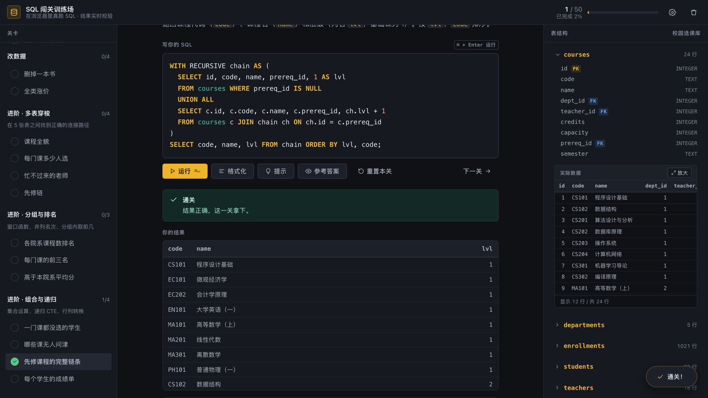
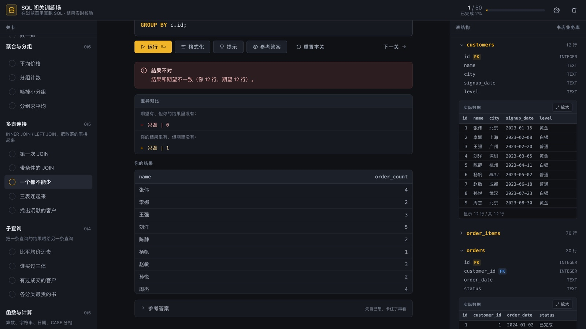

# SQL 闯关训练场

在浏览器里真跑 SQL 的闯关练习工具。50 道关卡，每道题写真正的 SQL，由 SQLite 执行后比对结果集，写错时告诉你差在哪一行。

不联网也能用，不起服务器，不装任何东西。



## 用

三种方式，随便挑一种：

```bash
# 1. 直接下载单文件版（推荐）
#    dist/sql-quest.html 双击打开，依赖全在里面

# 2. 在线用
#    https://4choor3.github.io/sql-quest/

# 3. 源码版（想改题库时用）
npm run serve        # → http://127.0.0.1:8123
```

单文件版 1.2MB，把 SQLite 引擎的 wasm 转成 base64 塞进了 js。代价是体积涨三分之一，换来的是 `file://` 下也能跑——不用起 HTTP 服务，拷到 U 盘或者发给别人都行。

仓库里另附两份示例库的 `.sql`，可以拖进 DBeaver 或 Navicat 自己练。

## 关卡

基础篇 8 章 39 关，每关只引入一个新概念：

| 章节 | 关卡 | 内容 |
|---|---|---|
| SELECT 基础 | 5 | 取列、`LIMIT`、`WHERE`、`ORDER BY`、`DISTINCT` |
| 条件筛选 | 6 | 比较、`BETWEEN`、`IN`、`LIKE`、`IS NULL`、`AND` |
| 聚合与分组 | 6 | `COUNT` / `SUM` / `AVG` / `MAX`、`GROUP BY`、`HAVING` |
| 多表连接 | 5 | `JOIN ... ON`、三表连接、`LEFT JOIN`、找缺失行 |
| 子查询 | 4 | 标量子查询、`IN`、`EXISTS`、相关子查询 |
| 函数与计算 | 5 | 算术、`LENGTH`、`\|\|` 拼接、`strftime`、`CASE WHEN` |
| 窗口函数与 CTE | 4 | `ROW_NUMBER`、`PARTITION BY`、`WITH`、累计求和 |
| 改数据 | 4 | `INSERT` / `UPDATE` / `DELETE` |

进阶篇 3 章 11 关，换成校园选课库：

| 章节 | 关卡 | 内容 |
|---|---|---|
| 多表穿梭 | 4 | 三表连接、`LEFT JOIN` 计数、自连接、`HAVING` 筛分组 |
| 分组与排名 | 3 | 聚合后排名、`PARTITION BY` 取每组前 N、相关子查询比均值 |
| 组合与递归 | 4 | `NOT EXISTS`、递归 CTE 展开层级、`CASE WHEN` 行列转换 |

进阶关不难在语法，难在组合。表一多，得自己想清楚从哪张出发、怎么连过去；而且多半要拆两步，先算中间结果再基于它算答案。

### 两套库

基础篇用书店业务，五张表带真实外键：

```
authors(8) ──< books(25) ──< order_items(76) >── orders(30) >── customers(12)
```

数据是按教学需要造出来的，埋了几个坑。有个客户从没下过单，练 `LEFT JOIN` 的时候正好拿来分辨 `COUNT(o.id)` 和 `COUNT(*)`——后者会把没订单的那行数成 1。有本书的 `genre` 和 `published_year` 是 NULL，`IS NULL` 和相关子查询里的 `IS`（不是 `=`）都得用它。订单分已完成、已取消、待付款三种状态，聚合之前不先过滤就算错。

进阶篇自动切到校园选课，也是五张表，但 `courses.prereq_id` 指向同一张表的 `id`，自连接和递归 CTE 有真实的层级能展开：

```
departments(5) ──< teachers(18) ──< courses(24) ──┐
                     students(60) ──< enrollments(1021)
                          courses.prereq_id ──> courses.id
```

另外特意留了 5 个一节课都没选的学生，不然 `NOT EXISTS` 这类题没有正确答案。课程热度也拉开了差距（4 ~ 50 人），冷门课程的题目才有区分度。

切到进阶关时右侧面板会自动换成校园库，补全词库跟着换。

## 判题

答案写法定不下来，没法做文本比对。每关存一份参考 SQL，运行时现场算出期望结果，再和你的结果比。四种比法：`columns` 是列名加无序行集合，`ordered` 要求行顺序也对，`set` 只看行集合，`scalar` 比单个数值带浮点容差。

不通过时给差异清单，不是一句「答案错误」。



上面这张是故意写错的：`COUNT(*)` 会把没订单的客户数成 1。面板把「冯磊 0」和「冯磊 1」两行并排摆出来，比任何解释都直接。

另外加了关键字约束。题目要求用 `LEFT JOIN`，你写死 `WHERE name = '冯磊'` 凑答案会被拦下——结果对了，但这题白做了。

第 8 章会真的改数据，不过每次运行前都从快照恢复，反复点运行不会主键冲突。通关记录和每关草稿存在 localStorage，关掉浏览器再打开还在。

## 编辑器

语法高亮是按 token 上色的：关键字琥珀、内置函数蓝、字符串绿、数字橙、注释灰斜体、表名青。列名故意不着色——一屏里列名太密集，全上色反而看不清语句结构。

实现上是「文字透明的 textarea 叠在一层 `<pre>` 上面」。选区、光标、输入法都还是 textarea 的原生行为，看到的高亮来自底下那层。两层必须像素对齐，否则文字会重影，所以排版规则只写一处、两层共用，另外 textarea 用 `scrollbar-gutter: stable` 常驻预留滚动条槽位，高亮层补上同样的右内边距，两层的内容盒才等宽。

补全按光标位置排序。语句开头给关键字（`sel` → `SELECT`），`FROM` 或 `JOIN` 后面给表名（`bo` → `books`），查询中段给列名（`st` → `stock`），打了 `b.` 就只给 books 的列。列名会收敛到当前语句真正用到的表——写 `SELECT * FROM customers WHERE st` 不会再把 `books.stock` 混进来。

别名也认。写了 `COUNT(*) AS book_count`，后面打 `book_co` 能补出来；`WITH city_stat AS (...)` 之后能补 CTE 名；派生表后面打 `b.ti`，能从内层 SELECT 推出 `title`。字符串和注释里的假别名（`'AS fake_name'`）不会误入候选。

光标坐标是用镜像 div 量的：复刻 textarea 的计算样式，把光标之前的文本灌进去，再插一个 span 量位置。好处是字号改了自动跟随，不用改代码。

格式化走 sql-formatter 的 SQLite 方言，`Shift + Option + F` 或点按钮都行。全量包 312KB 带 20 多种方言，这项目只用 SQLite，就写了个 esbuild 插件把方言注册表换成只含 sqlite 的版本，压到 57KB。格式化用 `execCommand` 写回，`⌘Z` 能撤销；已经排好的再点会提示，不会白改一遍。

## 设置

顶栏齿轮里五项，存本机 localStorage，与闯关进度分开：

| 设置项 | 选项 |
|---|---|
| 外观主题 | 深色 / 浅色（带预览卡片） |
| 进入关卡时的初始代码 | 原样 / 格式化后 |
| 输入时自动补全 | 开启 / 关闭 |
| SQL 语法高亮 | 开启 / 关闭 |
| 右栏跟随当前关卡 | 开启 / 关闭 |

浅色不是把深色反过来。琥珀在白色上对比度不够，强调色压暗到了 `#9a6200`，六类语法色在白底上的对比度都在 4.8:1 以上。

## 开发

```bash
npm run serve     # 本地预览 :8123
npm run verify    # 题库自检：参考答案端到端 + 起始代码不该通关 + 负例拦截
npm run e2e       # 浏览器端到端 46 项
npm run editor    # 格式化 / 补全 / 高亮 56 项
npm run settings  # 设置面板 16 项
npm run fullplay  # 浏览器里把 50 关逐个打通
npm run adv       # 进阶 11 关逐个通关
npm run offline   # 单文件版 file:// + 断网验证
npm run live      # 部署后实测线上站点能不能真答题
npm run content   # 右侧表格 DOM 文本 vs SQL 结果逐格比对
npm run ui-audit  # 对比度 / 溢出 / 字号阶梯
npm run vendor    # 重新裁剪打包 sql-formatter
npm run build     # 裁剪依赖 + 打包 dist/sql-quest.html
npm run data      # 重新生成两套示例数据库（需 uv）
```

除了 `serve` 和 `build`，其余都要先起服务。改完题库务必跑 `verify`，它会检查每关参考答案能否通过自己的校验。

### 加一关

在 `src/levels.js`（或 `levels-adv.js`）对应章节的 `levels` 数组里追加：

```js
{
  id: '3-7',
  title: '关卡名',
  brief: '任务描述，支持 **粗体** 和 `行内代码`',
  hint: '提示，可选，有则显示提示按钮',
  starter: 'SELECT ',                    // 编辑器预填
  solution: 'SELECT ... FROM ...;',      // 参考答案
  compare: 'columns',                    // columns | ordered | set | scalar
  require: [['GROUP BY', /\bgroup\s+by\b/i]],  // 没出现就拦下，防硬编码
  // probe: 'SELECT ...',                // 仅 DML 关卡需要
}
```

加完跑 `npm run verify`，它会用你的 `solution` 反推期望结果并验证自洽。

## 项目结构

```
sql/
├── index.html              入口
├── src/
│   ├── levels.js           基础题库（39 关 · 书店库）
│   ├── levels-adv.js       进阶题库（11 关 · 校园库）
│   ├── engine.js           多数据集管理 / SQL 执行 / 结果比对 / 存档
│   ├── autocomplete.js     自动补全（词库 / 作用域 / 别名识别 / 光标定位）
│   ├── highlight.js        语法高亮（分词与着色）
│   ├── app.js              状态管理、界面渲染、设置面板
│   └── styles.css          样式
├── data/                   两套库的 .sql 与内联 js
├── vendor/                 sql.js、裁剪版 sql-formatter
├── tools/                  数据生成、构建、12 个测试脚本
└── dist/
    ├── sql-quest.html      单文件版（1190 KB，含 WASM 与两套库）
    ├── bookstore.sql       书店库
    └── campus.sql          校园选课库
```

## 依赖

sql.js 1.10.3 把 SQLite 编译成了 WebAssembly，查询全在浏览器本地跑，数据不出本机。页面本身零框架零构建。

测试用 playwright-core 配系统里已有的 Chrome，不额外下载浏览器。

MIT 协议。